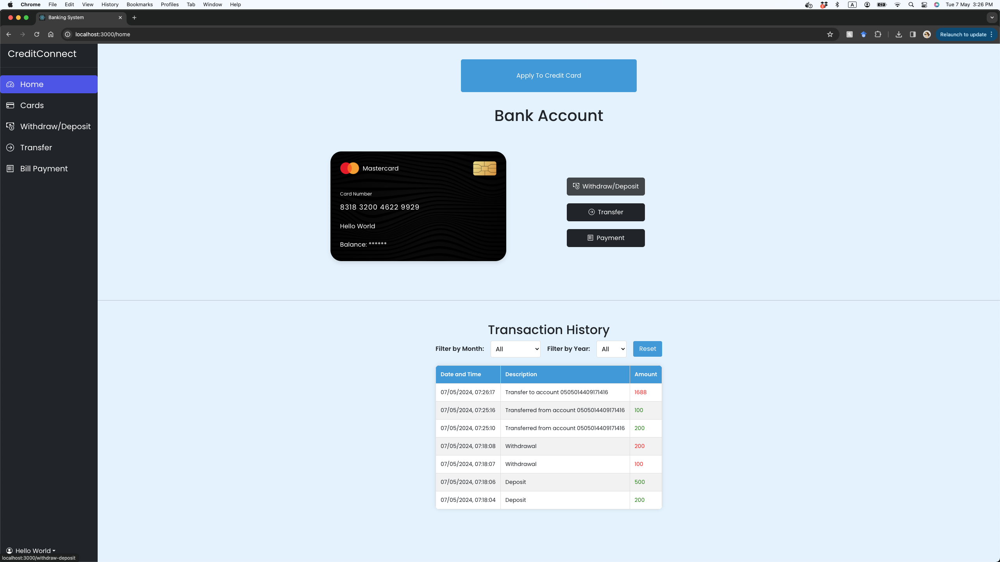
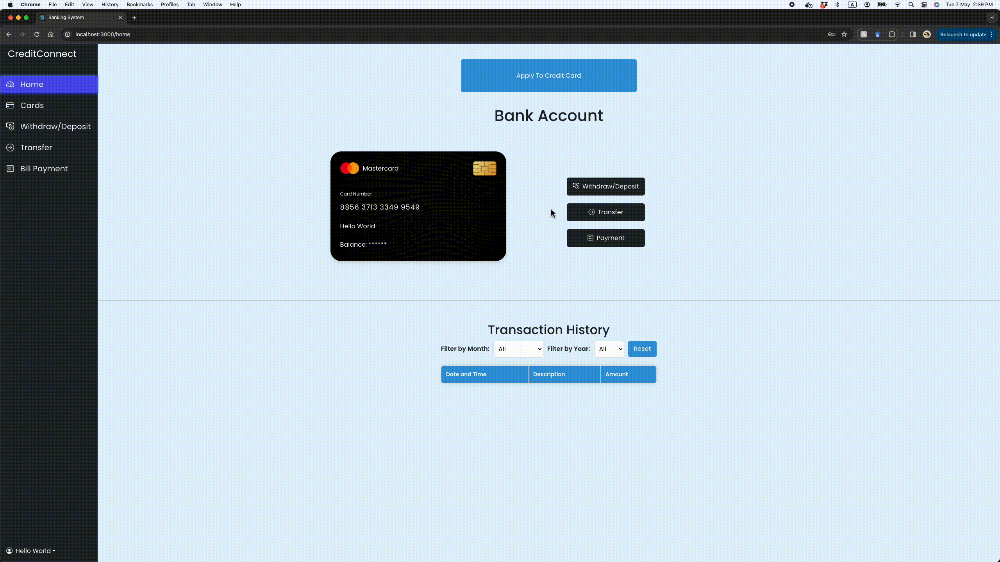
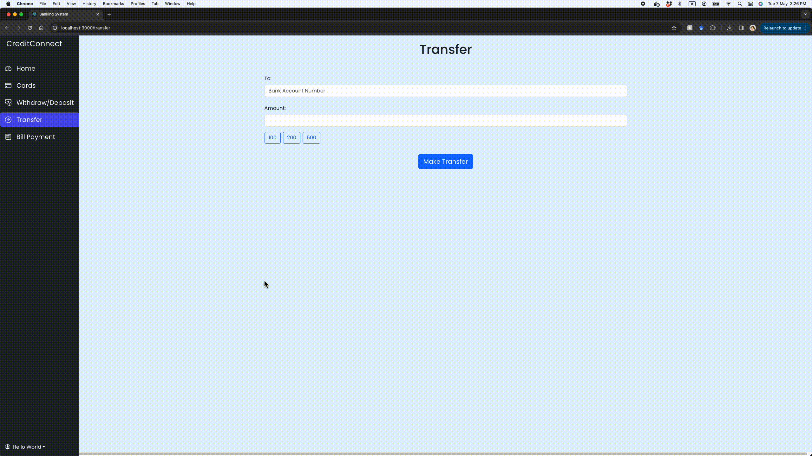
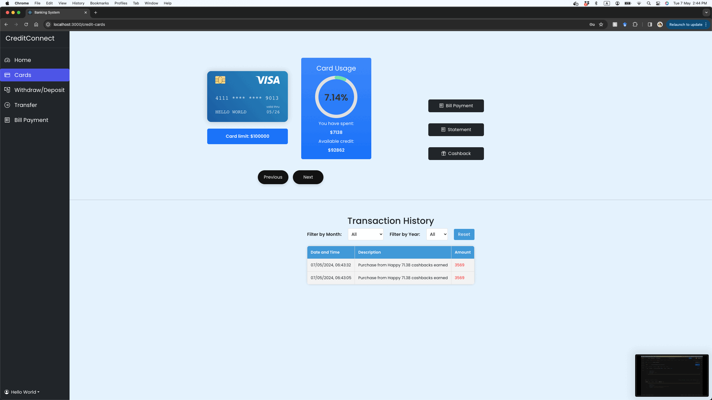
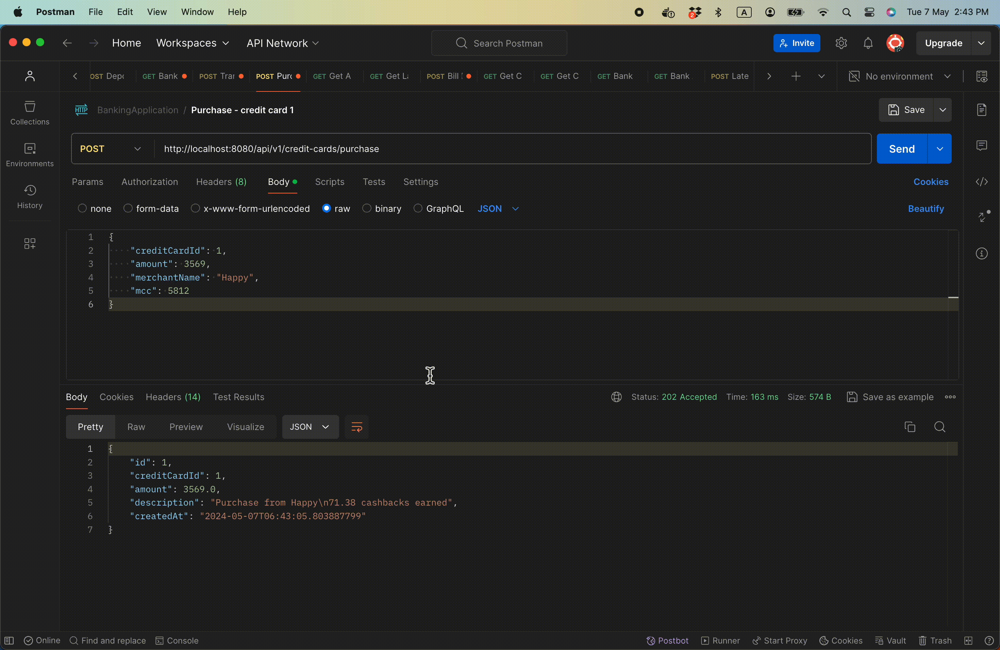
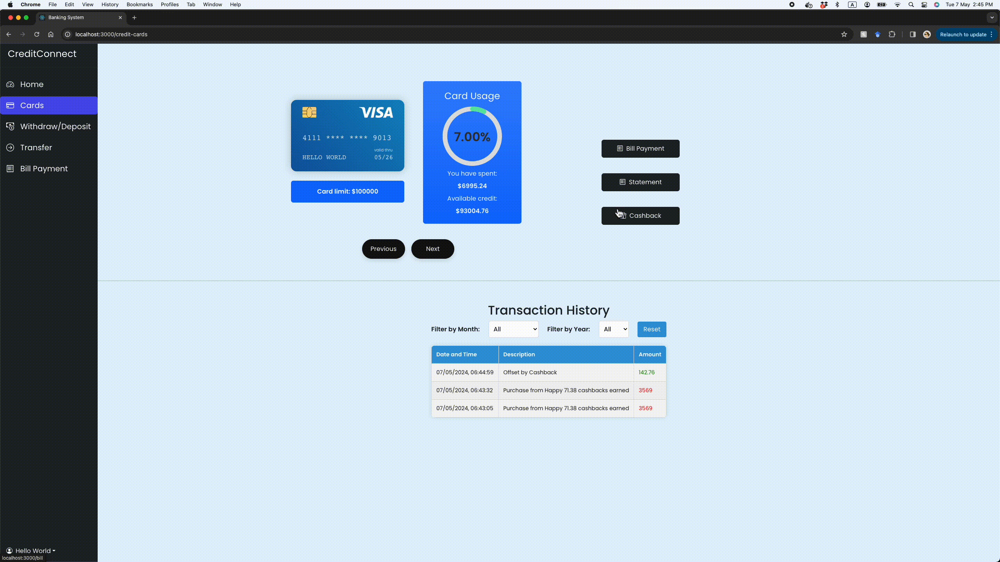
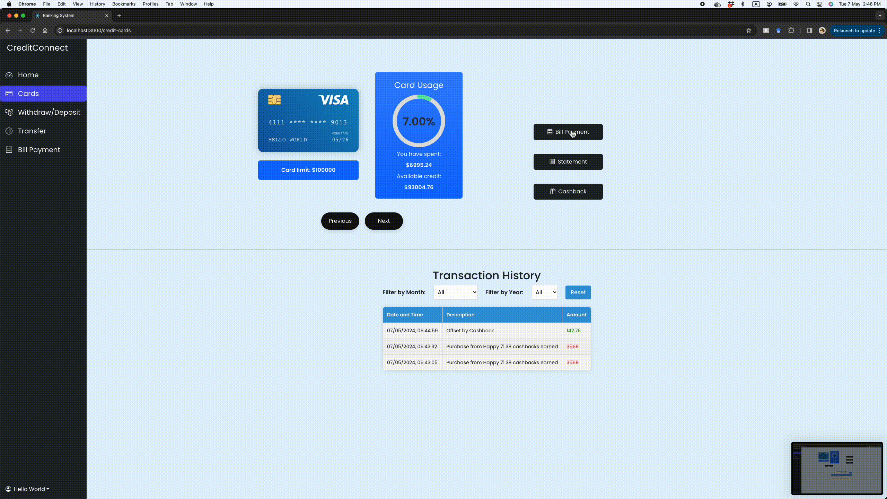
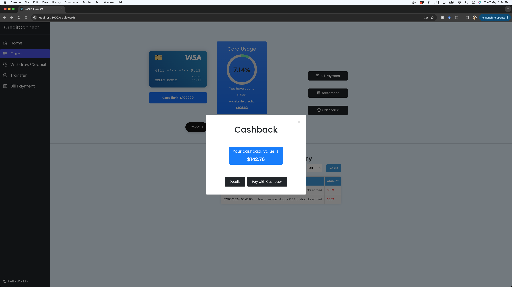

# E-banking Prototype

This is an e-banking web application prototype which supports bank account functionalities (withdraw, deposit and transfer) and credit card functionalities (purchase with credit card, automated monthly bill generation, bill payment and cashback feature). The web application is built using ReactJS for UI, Spring Boot for Rest API as backend server, and MySQL as database. It is a group project during FDM training with 7 other developers, in order to practice Agile methodology and to apply our knowledge in Spring Boot and ReactJS.


## Getting Started
Follow the steps below to set up and run the e-banking web application locally:

1. Make sure Docker and Docker Compose are installed on your machine.

2. Clone the repository:

	```
	git clone https://github.com/kakei5844/banking-application-forked.git
	```

3. Build the Docker images:
	```
	docker-compose build
	```

4. Start the application:

	```
	docker-compose up
	```
	This command will start the MySQL database, backend server, and frontend server.

5. Accessing the Application:

	Once the application is running, you can access it in the following ways:
	- Backend API: http://localhost:8080
	- Frontend UI: http://localhost:3000

6. Troubleshooting:

	If you encounter any issues while setting up or running the application, you can try the following:

	- Check the logs of individual containers using the docker logs <container-name> command.
	- Verify the status of containers using the docker ps command.
	- Ensure that there are no conflicts with ports 3309, 8080, and 3000 on your machine.

7. Stop the Application:

	To stop the application gracefully, use the following command:

	```
	docker-compose down
	```
	This command will stop and remove the running containers.


## Demo

### Bank Account Dashboard


### Deposit and Withdraw


### Transfer


### Credit Card Dashboard


### Purchase with Credit Card


### View Monthly Bill (automatcally generated each month)


### Pay Bill


### View Cashback value (Purchases with certain merchants give cashback)

